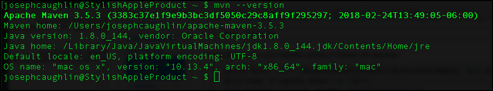

# INSTALLATION GUIDE

### Step 1: Test to see if Maven is installed Locally:
```mvn --version```

If maven is installed locally, you should see a screen that looks like this:




If you get a blank line, you've been letting Intellij do the hard work for you which is fine. However, until our Archetypes make their way to a Central Repository, you will have to install them locally via the CLI.


### Step 2: Install Maven Locally:

1. The current link to install maven is [https://maven.apache.org/download.cgi](https://maven.apache.org/download.cgi)
2. Unless you are brave or sooper dooper smart, don't choose the source code.
3. If you are the greatest of ever, download and unpack the tarball. In case you aren't sure of your level of awesomeness, go to the terminal and 
tar zxvf -thetarball.tar does the trick. No idea on Windows.
4. If your mp3 player is laden with a steady supply of Justin Bieber, open the zip.
5. Install whereever you like.
6. Whereever you do decide to install it, add the /bin directory to your PATH variable. In my case it resides, ```USERS/me/apache-maven-3.5.3/bin/ 

### Step 2a: Use a Package Manager
1. For the Mac, there is Homebrew [http://brewformulas.org/Maven](http://brewformulas.org/Maven) For the mac user who isn't familiar with [Homebrew}(https://brew.sh), it is a 3rd party package/dependency manager. The advantage is it will install everything at the root level in its own directory and it adds itself to your path. The only disadvantage to Homebrew is when it gets a little wobbly which can happen.
2. Linux...it is available via apt-get
3. npm also has an install but I am pretty sure it only works with the nodejs family.

******NOTE: If you do any of the following and still have issues, make sure JAVA_HOME has been set<br>
If it isn't, fret not. You aren't crazy. Intellij handles PATH variables on its own. Even if you point Intellij to your local install of the jdk, that doesn't affect whether $JAVA\_HOME Was set ******

With a Mac or Linux machine, a happy install looks like this:


##### **Brief Digression:** If my dear classmates who are owners of windows based machines sense any bitterness or assume I am making fun of them, I am not. Moreso, I a lamenting the fact that Microsoft stopped being innovative the day Steve Ballmer took over, if not sooner. Microsoft could have owned mobile. They could have been Google. Instead, their best workers were incentivized to compete against each other in order to remain employed. And no one at the top really cared because Windows kept selling. Yeah yeah yeah XBOX...That was one hit.

### Step 3: Install Your Archetype
1. Until I get access to the server down the hall or am brave enough to submit this to the Central Repository [http://central.sonatype.org/pages/requirements.html](http://central.sonatype.org/pages/requirements.html), you will have to install this the hard way.

2. Go to the root of the archetype directory and just for fun, you can do a ```mvn clean```.  However, the real party starts with ```mvn install```. You should get a happy message that a a jar was created and a copy of this archetype was put in your local .m2 directory.

#### If everything went as planned, you can find your archetype here:


